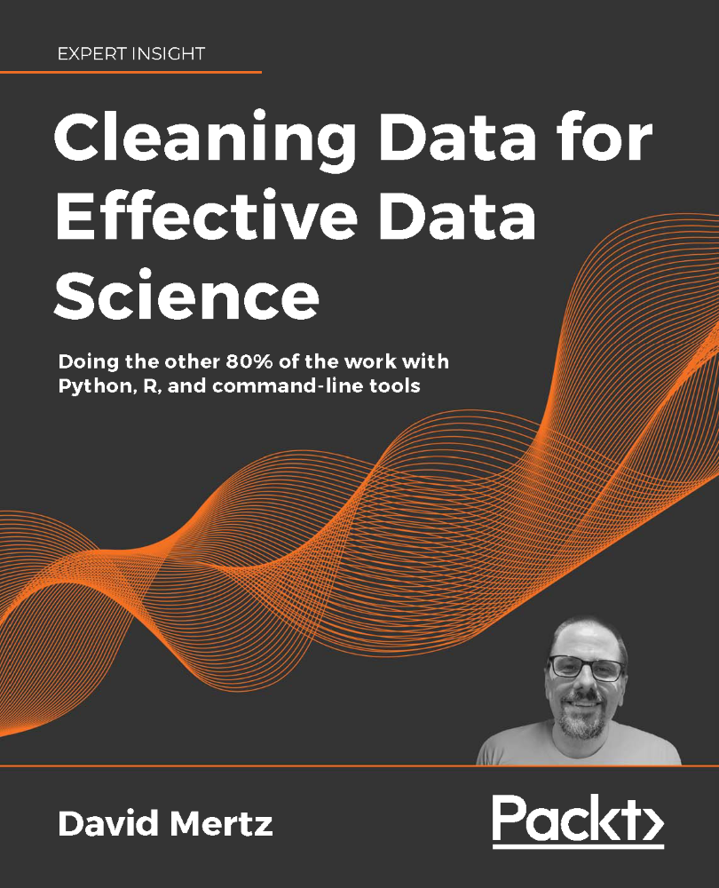

### Get this product for $5

<i>Packt is having its biggest sale of the year. Get this eBook or any other book, video, or course that you like just for $5 each</i>

<b>
[Buy now](https://packt.link/9781801071291)
</b>

<b>
[Buy similar titles for just $5](https://subscription.packtpub.com/search)
</b>

# Cleaning Data for Effective Data Science

This is the code repository for [Cleaning Data for Effective Data
Science](https://www.packtpub.com/product/cleaning-data-for-effective-data-science/9781801071291?utm_source=github&utm_medium=repository&utm_campaign=9781801071291),
published by [Packt](https://www.packtpub.com/?utm_source=github). It contains
all the supporting project files necessary to work through the book from start
to finish.

* **Paperback**: 498 pages
* **ISBN-13**: 9781801071291
* **Date Of Publication**: 30 March 2021

## Links

* [Amazon](https://www.amazon.com/gp/product/B08Z8GRYFY/)
* [Packt Publishing](https://www.packtpub.com/product/cleaning-data-for-effective-data-science/9781801071291)

## About the Book

It is something of a truism in data science, data analysis, or machine learning
that most of the effort needed to achieve your actual purpose lies in cleaning
your data. Written in David’s signature friendly and humorous style, this book
discusses in detail the essential steps performed in every production data
science or data analysis pipeline and prepares you for data visualization and
modeling results.

The book dives into the practical application of tools and techniques needed
for data ingestion, anomaly detection, value imputation, and feature
engineering. It also offers long-form exercises at the end of each chapter to
practice the skills acquired.

You will begin by looking at data ingestion of data formats such as JSON, CSV,
SQL RDBMSes, HDF5, NoSQL databases, files in image formats, and binary
serialized data structures. Further, the book provides numerous example data
sets and data files, which are available for download and independent
exploration.

Moving on from formats, you will impute missing values, detect unreliable data
and statistical anomalies, and generate synthetic features that are necessary
for successful data analysis and visualization goals.

By the end of this book, you will have acquired a firm understanding of the
data cleaning process necessary to perform real-world data science and machine
learning tasks.

## Instructions and Navigation

All of the code for each chapter is within Jupyter Notebooks.

## Table of Contents

0. [Preface](00-Preface.ipynb)
   1. Doing the Other 80% of the Work
   1. Types of Grime
   1. Nomenclature
   1. Typography
   1. Taxonomy
   1. Included Code
   1. Running the Book
   1. Using this Book
   1. Data Hygiene
   1. Exercises

1. [Data Ingestion – Tabular Formats](01-Data_Ingestion-Tabular.ipynb)
   1. Tidying Up
   1. CSV
   1. Spreadsheets Considered Harmful
   1. SQL RDBMS
   1. Other formats
   1. Data Frames
   1. Exercises
   1. Denouement

2. [Data Ingestion – Hierarchical Formats](02-Data_Ingestion-Hierarchical.ipynb)
   1. JSON
   1. XML
   1. Configuration Files
   1. NoSQL Databases
   1. Denouement

3. [Data Ingestion – Repurposing Data Sources](03-Data_Ingestion-Other.ipynb)
   1. Web Scraping
   1. Portable Document Format
   1. Image Formats
   1. Binary Serialized Data Structures
   1. Custom Text Formats
   1. Exercises
   1. Denouement

4. [Anomaly Detection](04-Anomaly_Detection.ipynb)
   1. Missing data
   1. Miscoded Data
   1. Fixed Bounds
   1. Outliers
   1. Multivariate Outliers
   1. Exercises
   1. Denouement

5. [Data Quality](05-Data_Quality.ipynb)
   1. Missing Data
   1. Biasing Trends
   1. Benford's Law
   1. Class Imbalance
   1. Normalization and Scaling
   1. Cyclicity and Autocorrelation
   1. Bespoke Validation
   1. Exercises
   1. Denouement

6. [Value Imputation](06-Value_Imputation.ipynb)
   1. Typical-Value Imputation
   1. Trend Imputation
   1. Sampling
   1. Exercises
   1. Denouement

7. [Feature Engineering](07-Feature_Engineering.ipynb)
   1. Date/time fields
   1. String fields
   1. String Vectors
   1. Decompositions
   1. Quantization and Binarization
   1. One-Hot Encoding
   1. Polynomial Features
   1. Exercises
   1. Denouement

8. [Closure](08-Closure.ipynb)
   1. What You Know
   1. What You Don't Know (Yet)

9. [Glossary](Glossary.ipynb)

## Related Products

* [Clean Code in Python - Second Edition](https://www.packtpub.com/product/clean-code-in-python-second-edition/9781800560215)
* [Machine Learning Using TensorFlow Cookbook](https://www.packtpub.com/product/machine-learning-using-tensorflow-cookbook/9781800208865)
* [Pandas 1.x Cookbook - Second Edition](https://www.packtpub.com/product/pandas-1-x-cookbook-second-edition/9781839213106)
### Download a free PDF

 <i>If you have already purchased a print or Kindle version of this book, you can get a DRM-free PDF version at no cost. Simply click on the link to claim your free PDF.</i>

 <a href="https://packt.link/free-ebook/9781801071291">https://packt.link/free-ebook/9781801071291 </a> 
